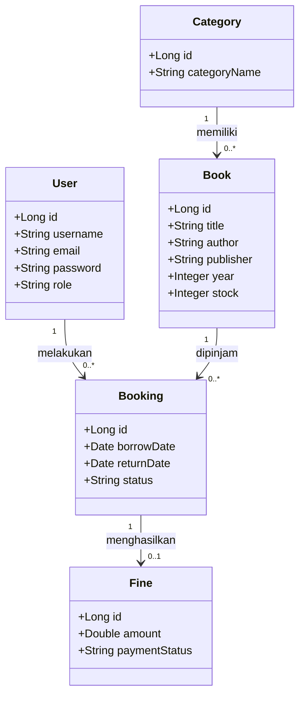
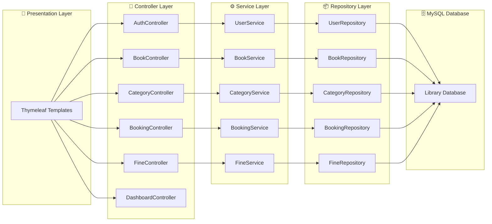

# 📐 Use Case Diagram & Class Diagram — Sistem Manajemen Perpustakaan Digital

Dokumen ini berisi **Use Case Diagram** dan **Class Diagram** yang dibuat berdasarkan analisis source code proyek **Sistem Manajemen Perpustakaan Digital** yang dikembangkan menggunakan **Java Spring Boot**, **Spring Data JPA**, **Thymeleaf**, dan **MySQL**.

---

# 1. 📋 Use Case Diagram

Diagram berikut menunjukkan interaksi antara **Admin** dan **Member** dengan Sistem Manajemen Perpustakaan Digital.

```mermaid
graph TB

subgraph Aktor
A["👨‍💼 Admin"]
M["👨‍🎓 Member"]
end

subgraph Auth["🔐 Autentikasi"]
UC1["Register"]
UC2["Login"]
UC3["Logout"]
end

subgraph Book["📚 Manajemen Buku"]
UC4["Lihat Daftar Buku"]
UC5["Tambah Buku"]
UC6["Edit Buku"]
UC7["Hapus Buku"]
UC8["Cari Buku"]
end

subgraph Category["📂 Manajemen Kategori"]
UC9["Lihat Kategori"]
UC10["Tambah Kategori"]
UC11["Edit Kategori"]
UC12["Hapus Kategori"]
end

subgraph Borrow["📖 Peminjaman Buku"]
UC13["Pinjam Buku"]
UC14["Lihat Riwayat Peminjaman"]
UC15["Kembalikan Buku"]
end

subgraph Fine["💰 Manajemen Denda"]
UC16["Hitung Denda"]
UC17["Bayar Denda"]
UC18["Lihat Riwayat Denda"]
end

subgraph Dashboard["📊 Dashboard"]
UC19["Dashboard Admin"]
UC20["Dashboard Member"]
end

A --> UC2
A --> UC3
A --> UC4
A --> UC5
A --> UC6
A --> UC7
A --> UC8
A --> UC9
A --> UC10
A --> UC11
A --> UC12
A --> UC14
A --> UC16
A --> UC17
A --> UC19

M --> UC1
M --> UC2
M --> UC3
M --> UC4
M --> UC8
M --> UC13
M --> UC14
M --> UC15
M --> UC18
M --> UC20
```

---

## 📝 Deskripsi Use Case

|  No | Use Case                 | Deskripsi                                     | Source Code         |
| :-: | ------------------------ | --------------------------------------------- | ------------------- |
|  1  | Register                 | Pengguna membuat akun baru.                   | AuthController      |
|  2  | Login                    | Pengguna masuk ke dalam sistem.               | AuthController      |
|  3  | Logout                   | Pengguna keluar dari sistem.                  | AuthController      |
|  4  | Lihat Daftar Buku        | Menampilkan seluruh data buku.                | BookController      |
|  5  | Tambah Buku              | Admin menambahkan buku baru.                  | BookController      |
|  6  | Edit Buku                | Admin mengubah data buku.                     | BookController      |
|  7  | Hapus Buku               | Admin menghapus data buku.                    | BookController      |
|  8  | Cari Buku                | Mencari buku berdasarkan judul atau kategori. | BookController      |
|  9  | Lihat Kategori           | Menampilkan seluruh kategori buku.            | CategoryController  |
|  10 | Tambah Kategori          | Admin menambahkan kategori.                   | CategoryController  |
|  11 | Edit Kategori            | Admin mengubah kategori.                      | CategoryController  |
|  12 | Hapus Kategori           | Admin menghapus kategori.                     | CategoryController  |
|  13 | Pinjam Buku              | Member melakukan peminjaman buku.             | BookingController   |
|  14 | Lihat Riwayat Peminjaman | Menampilkan daftar peminjaman.                | BookingController   |
|  15 | Kembalikan Buku          | Member mengembalikan buku.                    | BookingController   |
|  16 | Hitung Denda             | Menghitung denda keterlambatan.               | FineController      |
|  17 | Bayar Denda              | Mengelola pembayaran denda.                   | FineController      |
|  18 | Lihat Riwayat Denda      | Menampilkan daftar denda pengguna.            | FineController      |
|  19 | Dashboard Admin          | Menampilkan informasi statistik perpustakaan. | DashboardController |
|  20 | Dashboard Member         | Menampilkan informasi peminjaman pengguna.    | DashboardController |

---

# 2. 📊 Class Diagram

Diagram berikut menunjukkan hubungan antar entity pada Sistem Manajemen Perpustakaan Digital.

---

## 📝 Penjelasan Relasi Antar Class

| Relasi              | Kardinalitas | Penjelasan                                                                                |
| ------------------- | :----------: | ----------------------------------------------------------------------------------------- |
| **User → Booking**  |   1 : 0..*   | Satu pengguna dapat melakukan banyak peminjaman buku.                                     |
| **Category → Book** |   1 : 0..*   | Satu kategori memiliki banyak buku.                                                       |
| **Book → Booking**  |   1 : 0..*   | Satu buku dapat dipinjam berkali-kali pada waktu yang berbeda.                            |
| **Booking → Fine**  |   1 : 0..1   | Setiap transaksi peminjaman dapat menghasilkan satu denda apabila terlambat dikembalikan. |

---

## 🏗️ Ringkasan Arsitektur Sistem

---

# 📌 Daftar Entity

* User
* Book
* Category
* Booking
* Fine

---

# 📌 Daftar Controller

* AuthController
* BookController
* CategoryController
* BookingController
* FineController
* DashboardController

---

# 📌 Daftar Repository

* UserRepository
* BookRepository
* CategoryRepository
* BookingRepository
* FineRepository

---

## 📌 Catatan

> Semua diagram di atas dibuat berdasarkan struktur aplikasi **Sistem Manajemen Perpustakaan Digital** yang menggunakan konsep **Object Oriented Programming (OOP)** dengan arsitektur **Model-View-Controller (MVC)**. Diagram Mermaid dapat langsung ditampilkan oleh GitHub atau diedit menggunakan **Mermaid Live Editor** untuk menghasilkan gambar PNG maupun SVG.
