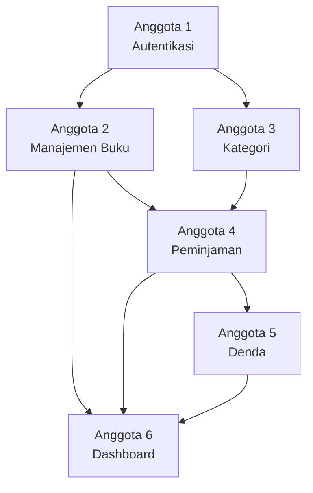

# 📋 Pembagian Tugas Proyek **Sistem Manajemen Perpustakaan Digital**

> Proyek ini merupakan aplikasi **Sistem Manajemen Perpustakaan Digital** berbasis **Spring Boot (Java)** dengan framework **Spring MVC**, **Spring Data JPA**, **Thymeleaf**, dan database **MySQL**. Pembagian tugas dilakukan berdasarkan modul utama agar setiap anggota memiliki tanggung jawab yang jelas dan saling terintegrasi.

---

# 🗂️ Ringkasan Struktur Proyek

| Layer                  | Komponen                                                                                                   |
| ---------------------- | ---------------------------------------------------------------------------------------------------------- |
| **Backend Entity**     | User, Book, Category, Booking, Fine                                                                        |
| **Backend Repository** | UserRepository, BookRepository, CategoryRepository, BookingRepository, FineRepository                      |
| **Backend Service**    | UserService, BookService, CategoryService, BookingService, FineService                                     |
| **Backend Controller** | AuthController, BookController, CategoryController, BookingController, FineController, DashboardController |
| **Frontend Template**  | Halaman Login, Dashboard, Buku, Kategori, Booking, Denda, Profil                                           |
| **Database**           | MySQL (Library Database)                                                                                   |

---

# 👤 Anggota 1 — Autentikasi & Manajemen User

**Fokus : Login, Register, Manajemen User**

## 🗄️ Backend

| File                             | Deskripsi                  |
| -------------------------------- | -------------------------- |
| `entity/User.java`               | Entity data pengguna       |
| `repository/UserRepository.java` | Repository data user       |
| `service/UserService.java`       | Business logic user        |
| `controller/AuthController.java` | Login, Register dan Logout |

## 🎨 Frontend

| File            | Deskripsi          |
| --------------- | ------------------ |
| `login.html`    | Halaman login      |
| `register.html` | Halaman registrasi |
| `profile.html`  | Profil pengguna    |

## 🗃️ Database

* Tabel `users`

---

# 👤 Anggota 2 — Manajemen Buku

**Fokus : CRUD Buku & Pencarian Buku**

## 🗄️ Backend

| File                             | Deskripsi           |
| -------------------------------- | ------------------- |
| `entity/Book.java`               | Entity data buku    |
| `repository/BookRepository.java` | Repository buku     |
| `service/BookService.java`       | Business logic buku |
| `controller/BookController.java` | CRUD buku           |

## 🎨 Frontend

| File               | Deskripsi   |
| ------------------ | ----------- |
| `books.html`       | Daftar buku |
| `add-book.html`    | Tambah buku |
| `edit-book.html`   | Edit buku   |
| `book-detail.html` | Detail buku |

## 🗃️ Database

* Tabel `books`

---

# 👤 Anggota 3 — Manajemen Kategori

**Fokus : Kategori Buku**

## 🗄️ Backend

| File                                 | Deskripsi               |
| ------------------------------------ | ----------------------- |
| `entity/Category.java`               | Entity kategori         |
| `repository/CategoryRepository.java` | Repository kategori     |
| `service/CategoryService.java`       | Business logic kategori |
| `controller/CategoryController.java` | CRUD kategori           |

## 🎨 Frontend

| File                 | Deskripsi       |
| -------------------- | --------------- |
| `categories.html`    | Daftar kategori |
| `add-category.html`  | Tambah kategori |
| `edit-category.html` | Edit kategori   |

## 🗃️ Database

* Tabel `categories`

---

# 👤 Anggota 4 — Peminjaman & Pengembalian Buku

**Fokus : Booking Buku**

## 🗄️ Backend

| File                                | Deskripsi                 |
| ----------------------------------- | ------------------------- |
| `entity/Booking.java`               | Entity peminjaman         |
| `repository/BookingRepository.java` | Repository peminjaman     |
| `service/BookingService.java`       | Business logic peminjaman |
| `controller/BookingController.java` | CRUD peminjaman           |

## 🎨 Frontend

| File                | Deskripsi          |
| ------------------- | ------------------ |
| `borrow-book.html`  | Form peminjaman    |
| `booking-list.html` | Riwayat peminjaman |
| `return-book.html`  | Pengembalian buku  |

## 🗃️ Database

* Tabel `bookings`

---

# 👤 Anggota 5 — Manajemen Denda

**Fokus : Perhitungan Denda**

## 🗄️ Backend

| File                             | Deskripsi            |
| -------------------------------- | -------------------- |
| `entity/Fine.java`               | Entity denda         |
| `repository/FineRepository.java` | Repository denda     |
| `service/FineService.java`       | Business logic denda |
| `controller/FineController.java` | Kelola denda         |

## 🎨 Frontend

| File               | Deskripsi        |
| ------------------ | ---------------- |
| `fine-list.html`   | Daftar denda     |
| `fine-detail.html` | Detail denda     |
| `payment.html`     | Pembayaran denda |

## 🗃️ Database

* Tabel `fines`

---

# 👤 Anggota 6 — Dashboard & Laporan

**Fokus : Dashboard, Statistik dan Laporan**

## 🗄️ Backend

| File                                  | Deskripsi            |
| ------------------------------------- | -------------------- |
| `controller/DashboardController.java` | Dashboard sistem     |
| `LibraryApplication.java`             | Main Application     |
| `application.properties`              | Konfigurasi aplikasi |
| `data.sql`                            | Data awal aplikasi   |

## 🎨 Frontend

| File                    | Deskripsi        |
| ----------------------- | ---------------- |
| `dashboard-admin.html`  | Dashboard Admin  |
| `dashboard-member.html` | Dashboard Member |
| `report.html`           | Laporan          |
| `profile.html`          | Profil pengguna  |

## 🗃️ Database

* Mengakses seluruh tabel untuk menampilkan statistik.

---

# 📊 Perbandingan Pembagian Tugas

| Anggota       | Domain              | File Backend | File Frontend | Total File |
| ------------- | ------------------- | :----------: | :-----------: | :--------: |
| **Anggota 1** | Autentikasi & User  |       4      |       3       |    **7**   |
| **Anggota 2** | Manajemen Buku      |       4      |       4       |    **8**   |
| **Anggota 3** | Manajemen Kategori  |       4      |       3       |    **7**   |
| **Anggota 4** | Peminjaman Buku     |       4      |       3       |    **7**   |
| **Anggota 5** | Manajemen Denda     |       4      |       3       |    **7**   |
| **Anggota 6** | Dashboard & Laporan |       4      |       4       |    **8**   |

> [!NOTE]
> Pembagian tugas dilakukan berdasarkan modul utama pada sistem sehingga setiap anggota bertanggung jawab terhadap satu fitur secara utuh, mulai dari entity, repository, service, controller, frontend, hingga pengujian modul tersebut.

---

# 🔗 Dependensi Antar Anggota

> [!IMPORTANT]
> Modul **Autentikasi** menjadi dasar seluruh sistem karena semua pengguna harus melakukan login sebelum mengakses fitur lain. Modul **Manajemen Buku** dan **Kategori** menjadi fondasi proses peminjaman. Setelah proses peminjaman selesai, sistem akan mengelola **denda** jika terjadi keterlambatan, sedangkan **Dashboard** menampilkan rekapitulasi seluruh data dari setiap modul.
